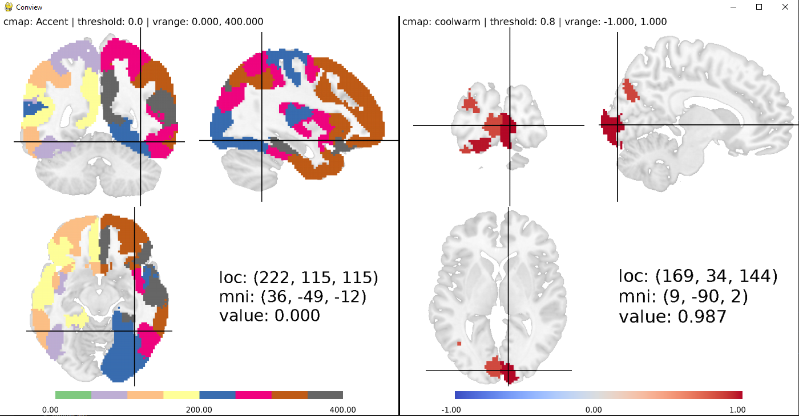

# Conview

## Usage

This is Conview, a tool to get an intuitive grasp of your connectivity matrices.
To view the connectivity of a region on the right side, hold control while you
click on the Region on the Left side.



You need two files to use this program:
1. A 4D nifti, which holds all the images that are represented by one column in your
connectivity matrix.
2. A 3D Atlas nifti file, which for each region has the value that implies the
index in the forth dimension of the 4D nifti. At that index, the 4D nifti should
contain a 3D volume that displays the connectivity of the region in the atlas
image with the rest of the brain.

If you have those two images, just start the program by typing 
`conview <atlas file path> <4d nifti file path>` into the command line

List of Hotkeys:
(all changes will apply to the side you clicked on last, left if you havent 
clicked yet)

t: set threshold  
m: change color map  
i: change vmin  
a: change vmax  
v: reset vrange to default  
g: toggle location and value information  
h: show help

## Installation

Conview is written in Python and requires version 3.9. If you have it installed, you can install conview by typing 

```
pip install git+https://github.com/KnorrFG/conview.git
```

into your command line. This method of installation requires git.
